# SMILE: Sinie's Medical Imaging Library Endeavor
### _Programming for Medical Imaging_
##### Sinie van der Ben, 6021794

[](https://travis-ci.org/joemccann/dillinger)

SMILE is a basic imaging library which contains a few filters but is ready for extension.

- Filters 
- Pipelines
- Improvement
- Further suggestions

#### Some notes on design choice
The only .cpp file in this project is the main. All other classes are placed in header files, due to the comment in assignment 2.02 that no .cpp files are needed for this project. 
Also apologies for the large images. Using Mou I was able to adjust size, but someone else without Mou was not able to properly watch my images. 
## Filters

- Threshold Filter
- Statistics Filter
- Masked Filter
- Convolutional Filter
- Sobel Filter
- Gaussian Blur kernel 5x5

#### Threshold Filter
Already implemented. Use a user-specified threshold and a direction (> or <). Values above or below are set to 0 (see Improvements).
#### Statistics Filter
The statistics filter calculates various properties of the image:
- mean
- max
- min
- pair of min and max
- standard deviation
- median
#### Masked Filter
A Masked filter takes into a mask and sets all values to 0 where the mask is 0. This is valuable when you want to highlight a specific part of an image. Users can specify a percentage of a random mask that has to be set to 0 or they can give a predefined mask to the filter. 
I did not include an image of this because I did not have a proper mask to demonstrate its values. 
#### Convolutional Filter
The Convolutional filter uses a kernel to apply convolution to the image. There are 2 convolutional filters: the 'basic' and the 'sharpen'. 
#####Pre Convolutional
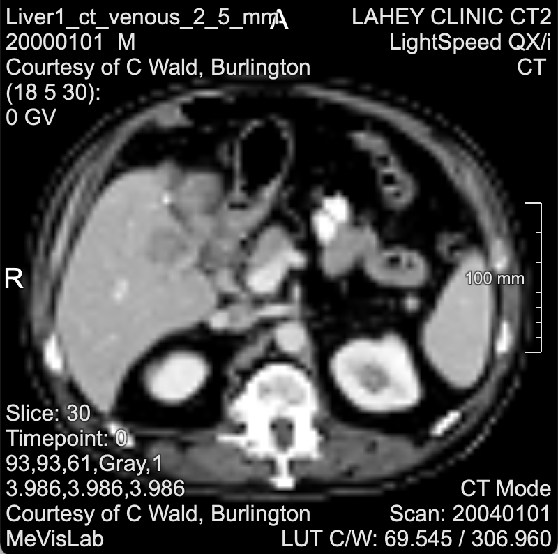
#####Post Convolutional
######Basic
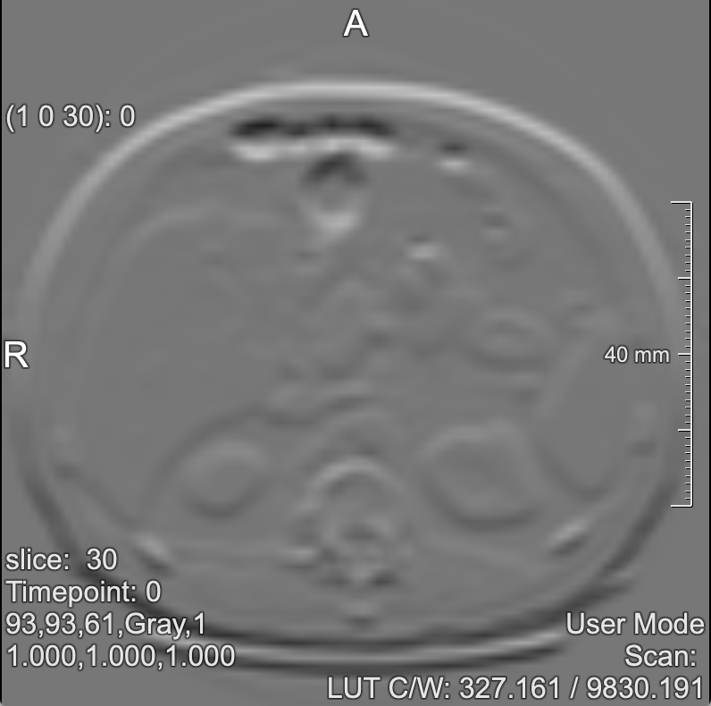
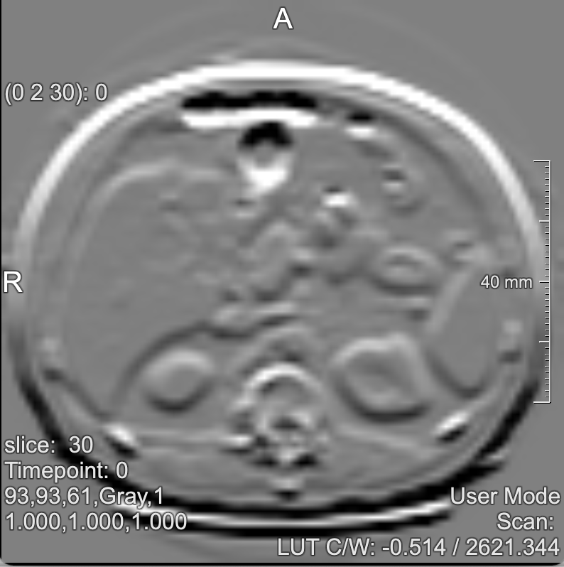
######Sharpen
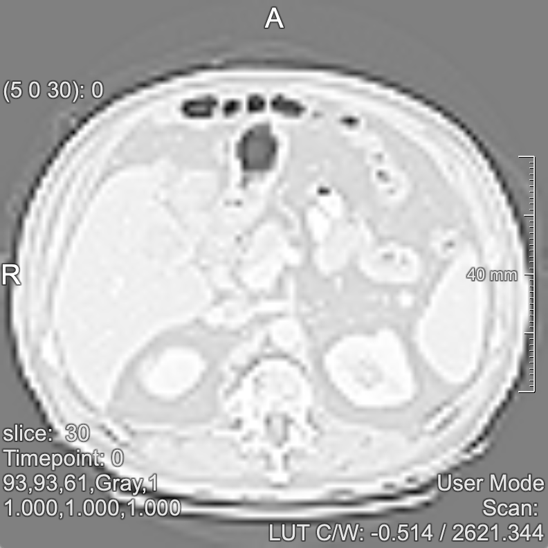
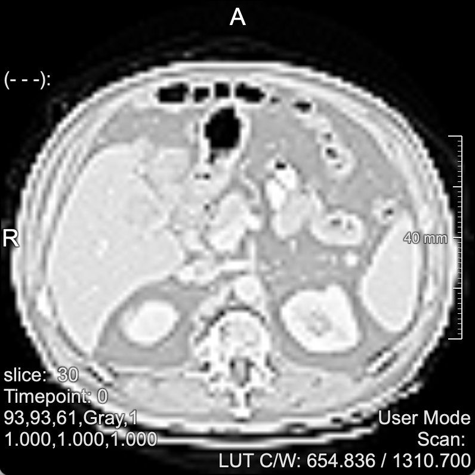
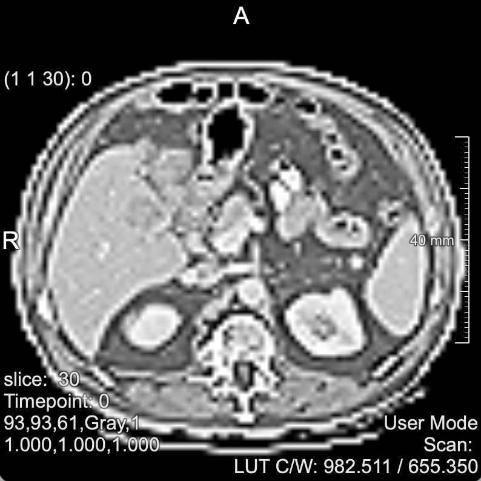
#### Sobel Filter
The Sobel filter is an edge detection filter. It has 2 kernels, one for the x direction and one for the y direction. The values are eventually added and square rooted for the final value of the image. 
#####Pre Sobel
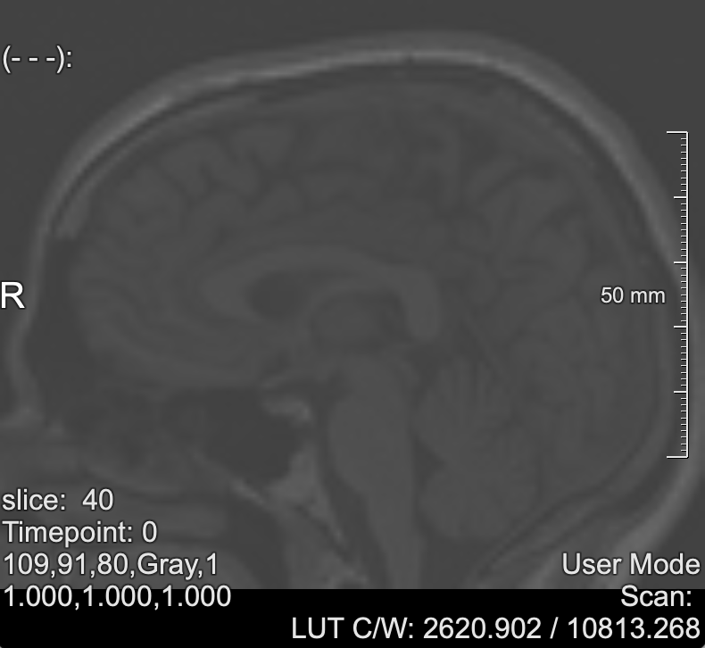
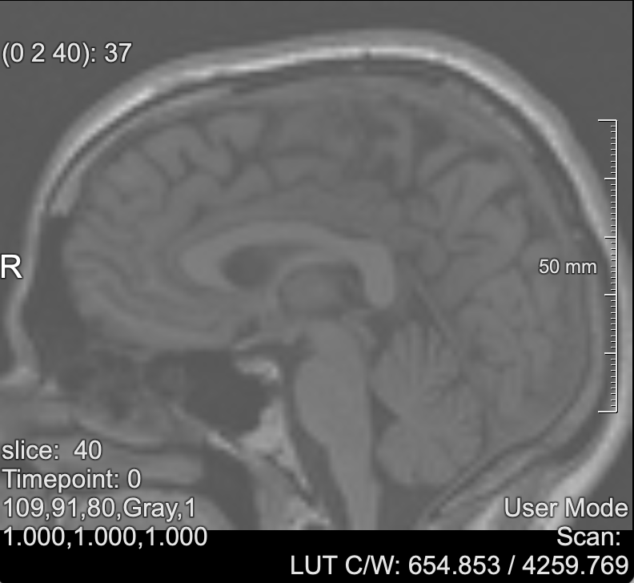
#####Post Sobel
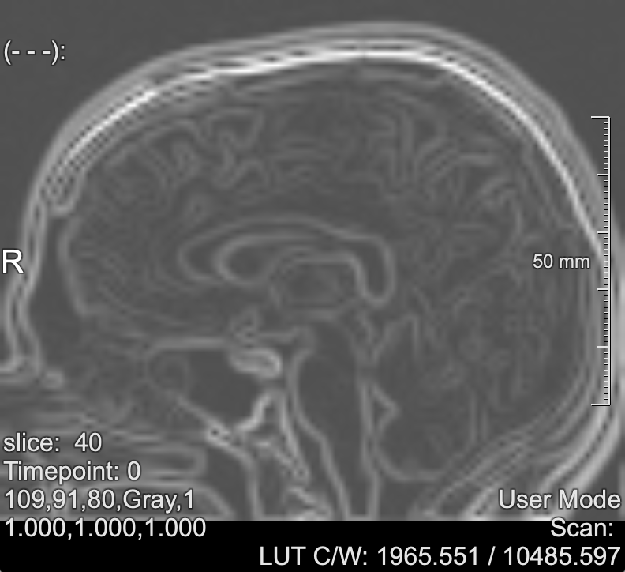
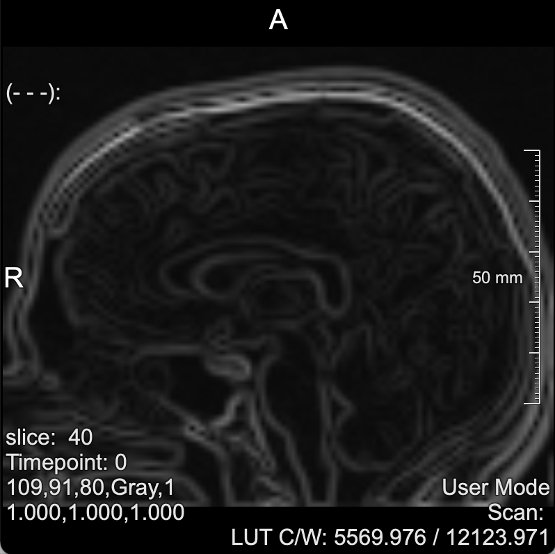
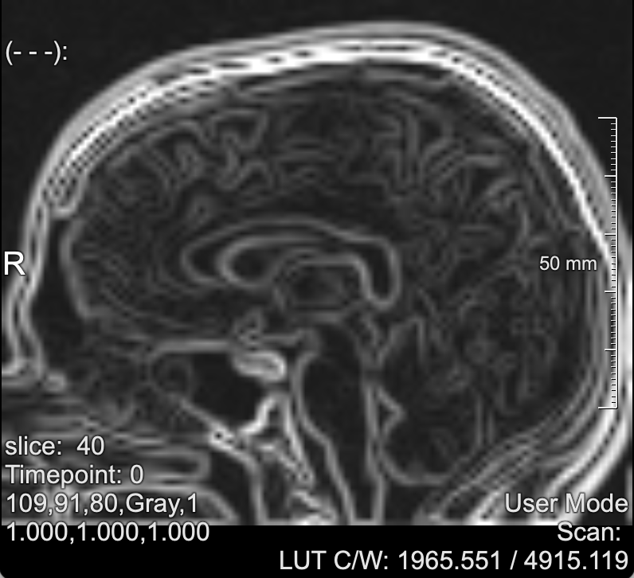
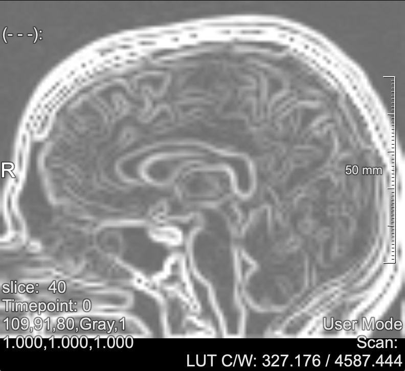
#### Gaussian Blur
The Gaussian Blur is a special convolution, where the kernel values are based on the standard deviation of the dataset. Its values depend on the standard deviation.
#####Pre Gaussian
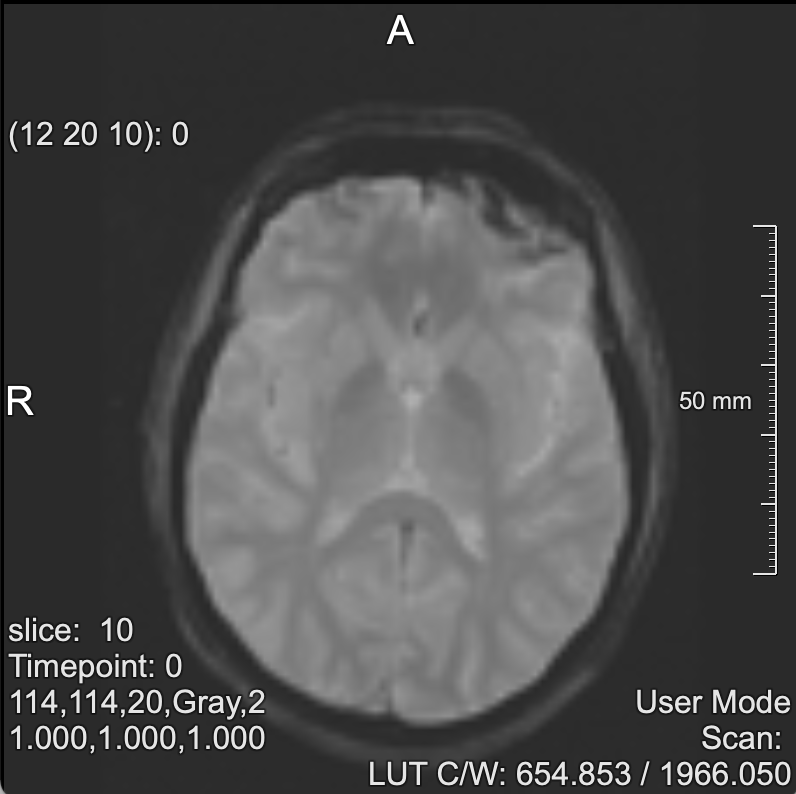
#####Post Gaussian
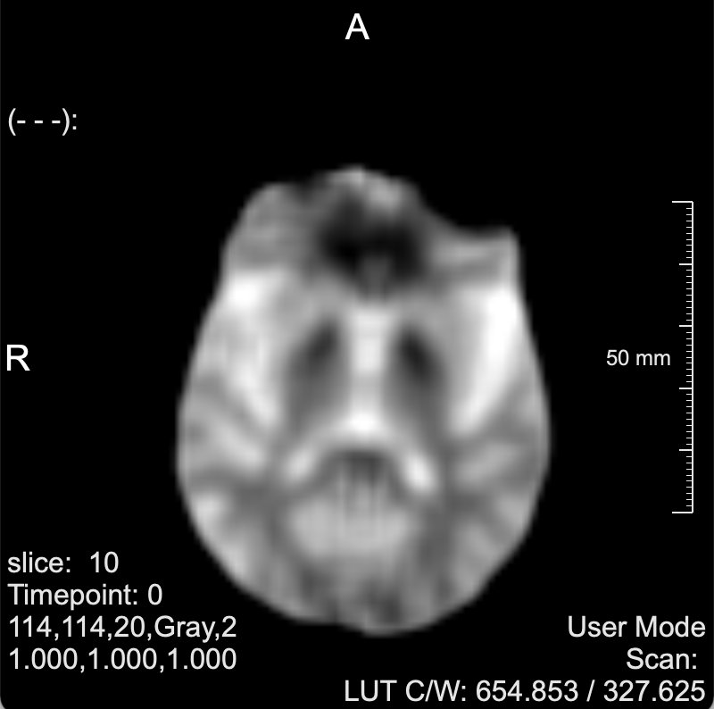
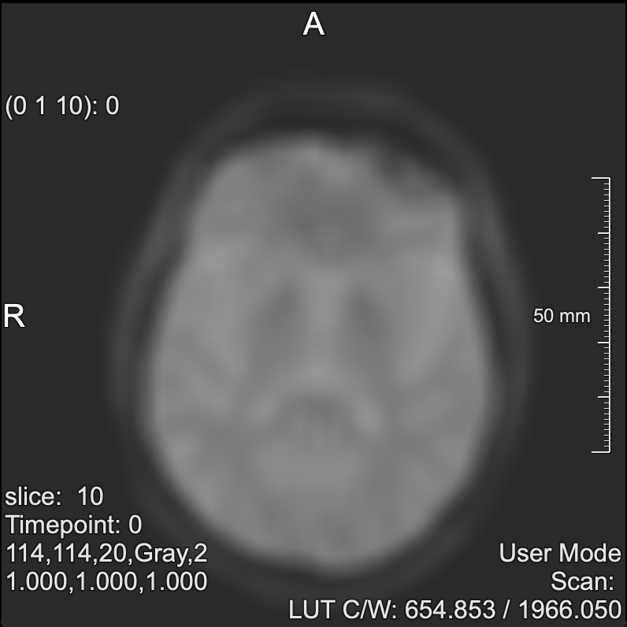

## Pipelines
The pipelines can be found in the main.cpp
### Pipeline 1
Find the standard deviation using the Statistics Filter and use this as the sigma in the Gaussian Blur
### Pipeline 2
Use the Sobel Filter for edge detection 
### Pipeline 3
Combine the Threshold and Masked filter. Use the Thresholdfilter to create a masked image with 1 and 0. Then use this mask in the Masked filter. 
The threshold can be user-input, mean or median. The user has to specify a threshold of type short, type of threshold by string "threshold", "mean" or "median" and the direction of the thresholding '>' or '<'

An example of a set threshold of 400, using > direction
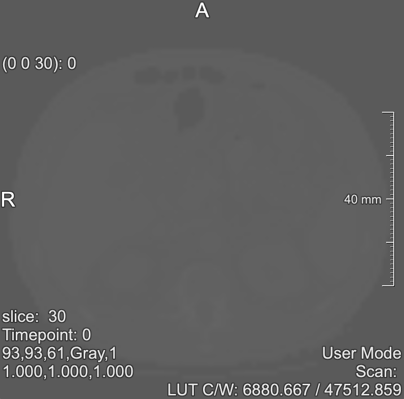
### Pipeline 4
Get the "sharpen" kernel of the Convolutional filter and apply this to the image. Optionally compare this with the Sobel edge detection. 
Arguments for this pipeline is the choice of kernel as a string: "basic" or "sharpen". Images of this can be found under the Convolutional Filter. 

## Improvements

Improvement to the Threshold Filter is the addition of the direction. Users can choose if they want to use '>' or '<'. The default is set to '>', like the previous implementation. In this way users can choose if they want to keep the values below or above. 

The ImageIO classes have to read and write the voxels. While writing can be done in one line for both classes, reading the voxels takes more space. Therefore the base class has two additional functions, called getVoxels() and readVoxels() to read in the voxels from the inputstream and update the pointers from the image with the values of the voxels.

In the ImageIOBase MHD class there are three methods added to make the search of the content of the desired information more robust to changes in the file. 
```sh
get_string(string &input, string keyword)
```
This function is made to find the line of a given keyword (such as NDims or ElementType) regardless of its position in the file. We cannot guarantee that NDims will always occur on a specific line number, which is why this method is added to make the search for NDims and its content robust.
```sh
findStringDigits(string &input, const char *key)
```
Once the string of NDims or DimSize has been found, we have to extract the numbers form it and this function takes care of that. Because this method works differently for NDims and DimSize, a key is used to distinguish between the two. Values of DimSize are initialized at 1, to account for 1 dimensional coordinates, because these are left empty in the original file.
```sh
findStringNames(string &input) 
```
This function finds the content of ElementType and ElementDataFile.

As an improvement, a general.h file contains functions that are used throughout the progam.

```sh 
calculateDimensions(array<int, N_DIM> dimensions)
```
Function to calculate the total number of voxels that should be in the file based on the given dimensions.
```sh
checkClamp(int coordinate, int maxRange)
```
Function to help with the lookup operators in image.h. It makes sure that coordinates are not -1 or out of range. It returns 0 when -1 or lower is given; it returns the maximum when a coordinate is out of range on the upper side.

## Future improvements 
### Statistics filter
The computation of the median and the standard deviation are quite heavy. A better way of implementing these functions would be to only calculate these when needed. 
### Gaussian Blur
The Gaussian Blur uses the standard deviation. Non-normalized pixel values can vary greatly in intensity, which means that the min and max can differ in thousands. To succesfully apply the Gaussian Blur (or also the other filters), I would suggest to normalize each pixel to a range of 255 or between 0 and 1. 
Additionally, the size of the Gaussian Blur filter is set to be 5 x 5. This was convenient for now, but an (easy) improvement would be a variation in size, such as 3 x 3. If so, the kernelobject can no longer be an array. This is also a similar improvement for the Convolutional Filter